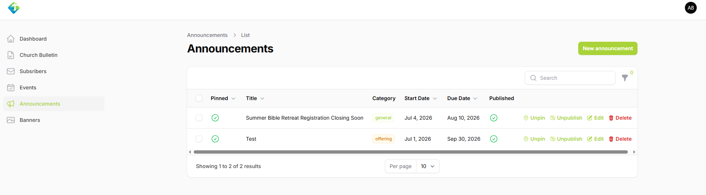
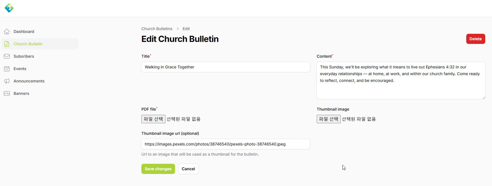

# AIM Church Busan — Backend

The backend API and admin panel for the AIM Church Busan website, built with Laravel. It serves events, sermons, announcements, church bulletins, and newsletter subscriptions to the [frontend](https://github.com/AIM-Church-Busan/aim_frontend), integrates with Planning Center for member authentication, and syncs content from YouTube and Instagram.

## Tech Stack

| Area | Technology |
| --- | --- |
| Framework | Laravel 12 (PHP 8.2+) |
| Admin panel | Filament 3 |
| Auth | Laravel Sanctum, Laravel Socialite (custom Planning Center provider) |
| Queue / Cache | Redis (Predis) |
| Error tracking | Sentry |
| Frontend build | Vite |
| Deployment | Docker (PHP-FPM + Nginx) |

## Features

- **Events** — public listing/detail endpoints, plus like and registration endpoints for authenticated members (`app/Http/Controllers/Api`, `app/Services/EventService.php`)
- **Announcements & Church Bulletins** — public read endpoints; creation/editing is admin-only via Filament
- **Sermons** — public endpoints for sermon list, live status, and upcoming sermons, synced from YouTube (`SermonService`, `YoutubeWebhookController`)
- **Newsletter subscriptions** — subscribe/confirm/unsubscribe flow with double opt-in confirmation emails and a rate-limited signup endpoint (`SubscriberController`, `app/Jobs/DispatchNewsletterJob.php`)
- **Planning Center authentication** — members log in via Planning Center OAuth (`app/Socialite/PlanningCenterProvider.php`, `app/Http/Controllers/Api/AuthController.php`)
- **Instagram feed sync** — OAuth connection and scheduled feed/token refresh (`InstagramFeedService`, `app/Console/Commands`)
- **Admin panel** — Filament resources for managing announcements, banners, church bulletins, events, and subscribers (`app/Filament/Resources`)

## API Overview

| Route | Description |
| --- | --- |
| `GET /api/events`, `GET /api/events/{event}` | Public event listing/detail |
| `POST /api/events/{event}/like` | Toggle like (auth required) |
| `POST /api/events/{event}/register`, `DELETE /api/events/{event}/register` | Register/cancel registration (auth required) |
| `GET /api/announcements`, `GET /api/announcements/{announcement}` | Public announcements |
| `GET /api/sermons`, `GET /api/sermons/live`, `GET /api/sermons/upcoming`, `GET /api/sermons/{id}` | Public sermon data |
| `GET /api/bulletins`, `GET /api/bulletins/{bulletin}` | Public church bulletins |
| `POST /api/subscribers` | Newsletter signup (rate-limited) |
| `GET /api/subscribers/confirm/{token}`, `GET /api/subscribers/unsubscribe/{token}` | Email confirmation / unsubscribe |
| `GET/POST /api/youtube/webhook` | YouTube PubSubHubbub webhook |
| `GET /api/instagram/auth/redirect`, `GET /api/instagram/auth/callback` | Instagram OAuth |
| `GET /api/instagram/feed` | Instagram feed |
| `POST /api/auth/logout`, `GET /api/auth/me` | Authenticated user (Planning Center guard) |
| `POST /api/internal/artisan/{command}` | Internal-only Artisan command trigger, protected by `X-Internal-Secret` header (used in deployments without shell access) |

See `routes/api.php` for the full route list.

## Data Model

Key Eloquent models (`app/Models`):

- `Event`, `EventLike`, `EventRegistration`
- `Announcement`
- `ChurchBulletin`
- `Banner`
- `Subscriber`
- `PlanningCenterUser`, `User`, `UserLifeGroup`
- `InstagramToken`

## Getting Started

### Prerequisites

- PHP 8.2+
- Composer
- Node.js (for asset building via Vite)
- Redis
- PostgreSQL (used in the Docker deployment) or another Laravel-supported database

### Installation

```bash
composer install
npm install
cp .env.example .env
php artisan key:generate
```

### Environment Variables

In addition to the standard Laravel variables (`APP_*`, `DB_*`, `REDIS_*`, `MAIL_*`), configure the following third-party integrations in `.env`:

```env
# Planning Center OAuth
PLANNING_CENTER_CLIENT_ID=
PLANNING_CENTER_CLIENT_SECRET=
PLANNING_CENTER_REDIRECT_URI=

# YouTube
YOUTUBE_API_KEY=
YOUTUBE_CHANNEL_ID=
YOUTUBE_WEBHOOK_SECRET=

# Instagram
INSTAGRAM_CLIENT_ID=
INSTAGRAM_CLIENT_SECRET=
INSTAGRAM_REDIRECT_URI=
INSTAGRAM_FEED_CACHE_TTL=1800

# Internal task trigger (see /api/internal/artisan/{command})
INTERNAL_TASK_SECRET=
```

### Database

```bash
php artisan migrate
```

### Development

Run the app, queue worker, log tailer, and Vite dev server together:

```bash
composer dev
```

Or individually:

```bash
php artisan serve
php artisan queue:listen
npm run dev
```

The Filament admin panel is available once you've created a user and are running the app locally (check `app/Providers/Filament` for the panel path).

### Scheduled Tasks

Two scheduled commands keep external integrations fresh (`routes/console.php`):

- `youtube:subscribe` — renews the YouTube PubSubHubbub subscription weekly
- `instagram:refresh-token` — refreshes the Instagram access token daily

Make sure the Laravel scheduler is running in production (e.g. a cron entry calling `php artisan schedule:run` every minute).

### Testing

```bash
composer test
```

## Deployment

A `Dockerfile` is provided (PHP-FPM + Nginx) along with `docker-entrypoint.sh` and `docker/nginx.conf` for containerized deployment.
